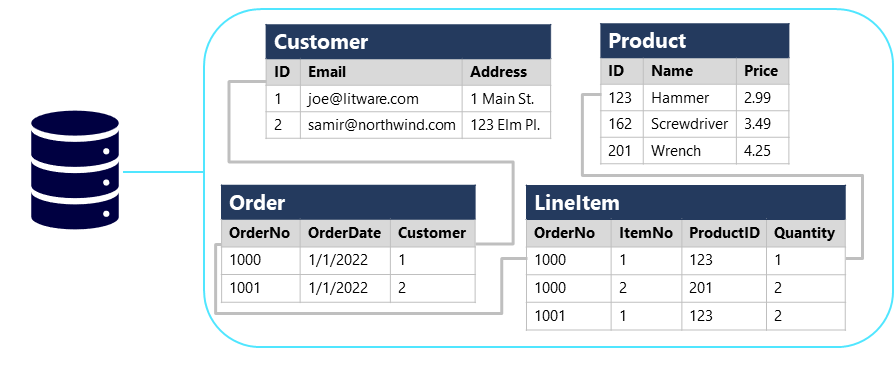

---
document:
  dp900Module: 'Módulo 1'
  dp900Unit: 'Unidad 4'
  dp900Title: 'Análisis sobre las bases de datos'
---

# Análisis sobre las bases de datos

Las bases de datos se usan para definir un sistema central en el que los datos se pueden almacenar y consultar. En un sentido simplista, el sistema de archivos en el que se almacenan los archivos es de un tipo de base de datos, pero cuando usamos el término en un contexto de datos profesional, normalmente nos referimos a un sistema dedicado para administrar registros de datos en lugar de archivos.

## Bases de datos relacionales

Las bases de datos relacionales suelen usarse para almacenar y consultar datos estructurados. Los datos se almacenan en __tablas__ que representan __entidades__, por ejemplo, clientes, productos o pedidos de ventas. A cada instancia de una entidad se le asigna una __clave principal__ que la identifica de forma única; estas claves se usan para hacer referencia a la instancia de entidad en otras tablas. Por ejemplo, se puede hacer referencia a la clave principal de un cliente en un registro de pedidos de ventas para indicar qué cliente ha realizado el pedido.

El uso de claves para hacer referencia a entidades de datos permite __normalizar__ una base de datos relacional. En parte, esto conlleva la eliminación de valores de datos duplicados para que, por ejemplo, los detalles de un cliente individual se almacenen una sola vez, no para cada pedido de ventas que realiza el cliente. Las tablas se administran y consultan mediante el _Lenguaje de Consulta Estructurado_ (SQL), que se basa en un estándar _ANSII_, por lo que es similar en varios sistemas de base de datos.

## Bases de datos no relacionales

Las bases de datos no relacionales son sistemas de administración de datos que no aplican un esquema relacional a los datos. Las bases de datos no relacionales suelen conocerse como bases de datos _NoSQL_, aunque algunas admiten una variante del lenguaje SQL.

Hay cuatro tipos comunes de bases de datos no relacionales que se usan habitualmente:

* Las __bases de datos clave-valor__, en las que cada registro consta de una clave única y un valor asociado, que puede estar en cualquier formato.

  

* Las __bases de datos de documentos__, que son una forma específica de base de datos clave-valor, en la que el valor es un documento JSON (en el que el sistema está optimizado para analizar y consultar).

  

* Las __bases de datos de familia de columnas__, que almacenan datos tabulares con filas y columnas, pero con la posibilidad de dividir esas columnas en grupos, conocidos como familias de columnas. Cada familia de columnas contiene un conjunto de columnas que tienen una relación lógica entre sí.

  

* Las __bases de datos de grafos__, que almacenan entidades como nodos con vínculos para definir relaciones entre ellas.

  

[Unidad siguiente: Análisis sobre el procesamiento de datos transaccionales](05-transactional-db.md)
