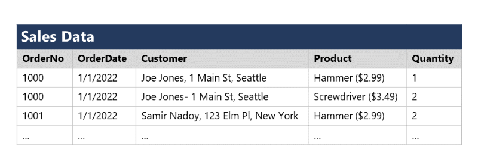
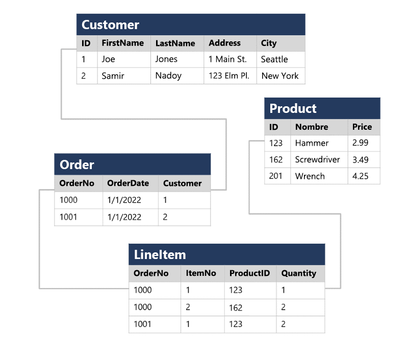

---
document:
  dp900Module: 'Módulo 3'
  dp900Unit: 'Unidad 3'
  dp900Title: 'Comprensión de la normalización'
---

# Comprensión de la normalización

La normalización es un término que usan los profesionales de bases de datos para referirse a un proceso de diseño de esquemas que reduce al mínimo la duplicación de los datos e impone la integridad de los datos.

Aunque hay muchas reglas complejas que definen el proceso de refactorización de los datos en varios niveles (_o formas_) de normalización, una definición sencilla a efectos prácticos sería:

1. Separar cada _entidad_ en su propia tabla.
1. Separar cada _atributo_ discreto en su propia columna.
1. Identificar de forma única cada instancia de entidad (fila) mediante una _clave principal_.
1. Usar columnas de _clave externa_ para vincular entidades relacionadas.

Para comprender los principios básicos de la normalización, supongamos que la tabla siguiente representa una hoja de cálculo que una empresa usa para realizar un seguimiento de sus ventas.

Observe que los detalles del cliente y del producto están duplicados para cada artículo individual que se vende. Además, el nombre del cliente y la dirección postal, así como el nombre del producto y el precio, están combinados en las mismas celdas de la hoja de cálculo.

Ahora veamos el modo en que la normalización cambia la forma de almacenar los datos.

Cada entidad que se representa en los datos (cliente, producto, pedido de ventas y artículo de línea) se almacena en su propia tabla, y cada atributo discreto de esas entidades está en su propia columna.

Al registrar cada instancia de una entidad como una fila en una tabla específica de la entidad, se elimina la duplicación de datos. Por ejemplo, para cambiar la dirección de un cliente, solo hace falta modificar el valor en una sola fila.

La descomposición de atributos en columnas individuales garantiza que cada valor esté restringido a un tipo de datos adecuado. Por ejemplo, los precios de los productos deben ser valores decimales, mientras que las cantidades de artículos de línea deben ser números enteros. Además, la creación de columnas individuales aporta un nivel útil de granularidad a los datos a la hora de realizar las consultas; por ejemplo, se puede filtrar fácilmente los clientes que viven en una ciudad concreta.

Las instancias de cada entidad se identifican de forma única mediante un identificador u otro valor de clave, conocido como _clave principal_, y cuando una entidad hace referencia a otra (por ejemplo, un pedido tiene un cliente asociado), la clave principal de la entidad relacionada se almacena como una _clave externa_. Se puede buscar la dirección del cliente (que se almacena solo una vez) para cada registro de la tabla __Order__ si hace referencia al registro correspondiente en la tabla __Customer__. Normalmente, un _Sistema de Administración de Bases de Datos Relacionales_ (RDBMS) puede aplicar la integridad referencial para garantizar que un valor especificado en un campo de clave externa tenga una clave principal correspondiente existente en la tabla relacionada (lo que, por ejemplo, impide la realización de pedidos para clientes que no existen).

En algunos casos, se puede definir una clave (principal o externa) como una clave compuesta basada en una combinación única de varias columnas. Por ejemplo, la tabla __LineItem__ del ejemplo anterior usa una combinación única de __OrderNo__ e __ItemNo__ para identificar un artículo de línea de un pedido individual.

[Unidad siguiente: Análisis de SQL](03-04-sql-analysis.md)
