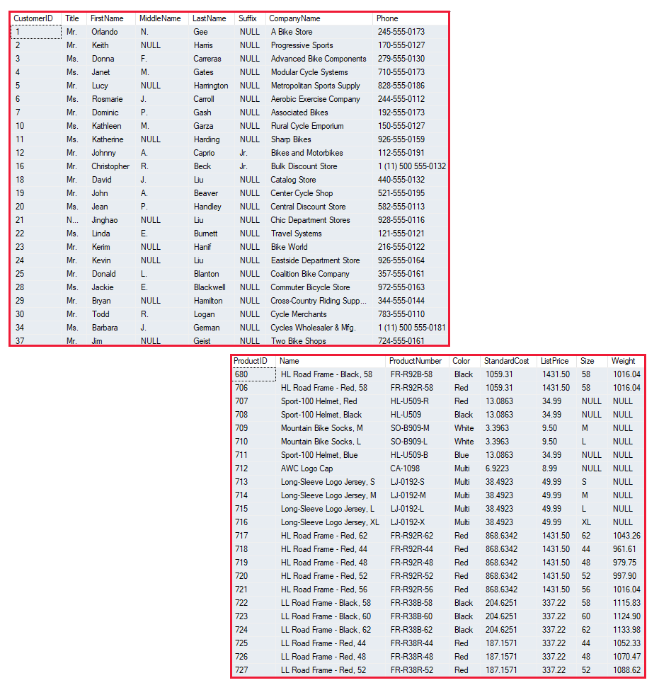

---
document:
  dp900Module: 'Módulo 1'
  dp900Unit: 'Unidad 2'
  dp900Title: 'Principales formatos de los datos'
---

# Identificación de los principales formatos de los datos

Los datos son una colección de elementos, como números, descripciones y observaciones, que se usan para registrar la información. Las estructuras de los datos en las que se organizan los mismos suelen representar __entidades__, las cuáles son importantes para una organización (como los clientes, productos, pedidos de ventas, etcétera). Normalmente, cada entidad tiene uno o varios __atributos__ o características (por ejemplo, un cliente podría tener un nombre, una dirección, un número de teléfono, etc.).

Los datos se pueden clasificar en __estructurados__, __semiestructurados__ o __no estructurados__.

## Datos estructurados

Los datos estructurados son aquellos que se ajustan a un __esquema__ fijo, en donde todos ellos tienen los mismos campos o propiedades. Normalmente, el esquema de las entidades de datos estructurados es __tabular__, es decir, los datos se representan en una o en varias tablas que constan de filas para representar cada instancia de una entidad de datos y columnas para representar los atributos de la entidad.

En la imagen siguiente se muestran las representaciones de datos tabulares para las entidades _Customer_ y _Product_:



Los datos estructurados suelen almacenarse en bases de datos en la que varias tablas pueden hacer referencia entre sí mediante el uso de valores de tipo __clave__ en un modelo __relacional__.

## Datos semiestructurados

Los datos semiestructurados tienen cierta __estructura__, pero que se le permiten alguna variación entre las instancias de entidad. Por ejemplo, aunque la mayoría de los clientes pueden tener una dirección de correo electrónico, algunos podrían tener varias y otros, ninguna.

Un formato común para los datos semiestructurados es la _notación de objetos JavaScript_ (JSON).

En el siguiente ejemplo se muestra un documento JSON que representa información de clientes. Cada cliente incluye la dirección y la información de contacto, pero hay campos específicos que varían entre los clientes:

```json
// Customer 1
{
  "firstName": "Joe",
  "lastName": "Jones",
  "address":
  {
    "streetAddress": "1 Main St.",
    "city": "New York",
    "state": "NY",
    "postalCode": "10099"
  },
  "contact":
  [
    {
      "type": "home",
      "number": "555 123-1234"
    },
    {
      "type": "email",
      "address": "joe@litware.com"
    }
  ]
}

// Customer 2
{
  "firstName": "Samir",
  "lastName": "Nadoy",
  "address":
  {
    "streetAddress": "123 Elm Pl.",
    "unit": "500",
    "city": "Seattle",
    "state": "WA",
    "postalCode": "98999"
  },
  "contact":
  [
    {
      "type": "email",
      "address": "samir@northwind.com"
    }
  ]
}
```

> Nota: JSON es solo una de las muchas maneras en las que se pueden representar los datos semiestructurados.

## Datos no estructurados

No todos los datos son estructurados o semiestructurados. Por ejemplo, los documentos, imágenes, datos de audio y de vídeo y archivos binarios podrían no tener una estructura específica. Este tipo de datos se los conoce como datos no estructurados.


## Almacenes de datos

Las organizaciones suelen almacenar los datos en formato estructurado, semiestructurado o no estructurado para registrar los detalles de las entidades (por ejemplo, de los clientes y productos), eventos específicos (como las transacciones de ventas) u otra información en documentos, imágenes y otros formatos. Los datos almacenados se pueden recuperar para su análisis y para la generación de informes.

Habitualmente se usan dos categorías generales de almacén de datos:

* Almacenes de archivos
* Bases de datos

[Unidad siguiente: Análisis sobre el almacenamiento de archivos](1-03-storing-files.md)
